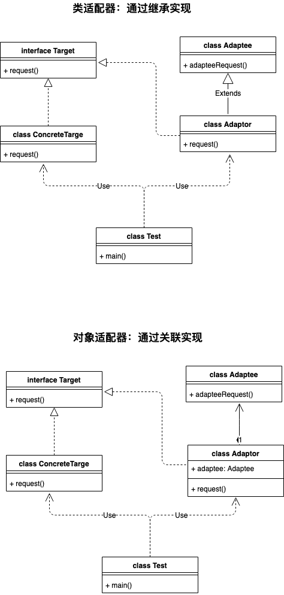

### 适配器模式

> 适配器模式(Adapter Pattern)：将一个接口转换成客户希望的另一个接口，使接口不兼容的那些类可以一起工作，其别名为包装器(Wrapper)。适配器模式既可以作为类结构型模式，也可以作为对象结构型模式。
>
> 在适配器模式中，我们通过增加一个新的适配器类来解决接口不兼容的问题，使得原本没有任何关系的类可以协同工作。
> 根据适配器类与适配者类的关系不同，适配器模式可分为对象适配器和类适配器两种，在对象适配器模式中，适配器与适配者之间是关联关系；在类适配器模式中，适配器与适配者之间是继承（或实现）关系。



**角色介绍**

> Target（目标抽象类）：目标抽象类定义客户所需接口，可以是一个抽象类或接口，也可以是具体类。
> Adapter（适配器类）：适配器可以调用另一个接口，作为一个转换器，对Adaptee和Target进行适配，适配器类是适配器模式的核心，在对象适配器中，它通过继承Target并关联一个Adaptee对象使二者产生联系。
> Adaptee（适配者类）：适配者即被适配的角色，它定义了一个已经存在的接口，这个接口需要适配，适配者类一般是一个具体类，包含了客户希望使用的业务方法，在某些情况下可能没有适配者类的源代码。

#### 类适配器

```java
public class Adaptee {
    public void adapteeRequest() {
        System.out.println("被适配者的方法");
    }
}

public interface Target {
    void request();
}

// 没使用适配器，直接调用，无法使用适配类方法
public class ConcreteTarget implements Target {
    @Override
    public void request() {
        System.out.println("concreteTarget目标方法");
    }
}

// 使用适配器
public class Adapter extends Adaptee implements Target{
    @Override
    public void request() {
        //...一些操作...
        super.adapteeRequest();
        //...一些操作...
    }
}

// 测试
public class Test {
    public static void main(String[] args) {
        Target target = new ConcreteTarget();
        target.request();

        Target adapterTarget = new Adapter();
        adapterTarget.request();
    }
}

// 输出
concreteTarget目标方法
被适配者的方法
```

#### 对象适配器

```java
public class Adapter implements Target{
    // 适配者是对象适配器的一个属性
    private Adaptee adaptee = new Adaptee(); // 核心点就是作为适配器的成员变量导入适配类

    @Override
    public void request() {
        //...
        adaptee.adapteeRequest();
        //...
    }
}
```

#### 适配器模式总结

类适配器模式还有如下优点：

由于适配器类是适配者类的子类，因此可以在适配器类中置换一些适配者的方法，使得适配器的灵活性更强。

对象适配器模式还有如下优点：

一个对象适配器可以把多个不同的适配者适配到同一个目标；
可以适配一个适配者的子类，由于适配器和适配者之间是关联关系，根据“里氏代换原则”，适配者的子类也可通过该适配器进行适配。

类适配器模式的缺点如下：

对于Java、C#等不支持多重类继承的语言，一次最多只能适配一个适配者类，不能同时适配多个适配者；
适配者类不能为最终类，如在Java中不能为final类，C#中不能为sealed类；
在Java、C#等语言中，类适配器模式中的目标抽象类只能为接口，不能为类，其使用有一定的局限性。

对象适配器模式的缺点如下：

与类适配器模式相比，要在适配器中置换适配者类的某些方法比较麻烦。如果一定要置换掉适配者类的一个或多个方法，可以先做一个适配者类的子类，将适配者类的方法置换掉，然后再把适配者类的子类当做真正的适配者进行适配，实现过程较为复杂。

#### 适用场景

系统需要使用一些现有的类，而这些类的接口（如方法名）不符合系统的需要，甚至没有这些类的源代码。
想创建一个可以重复使用的类，用于与一些彼此之间没有太大关联的一些类，包括一些可能在将来引进的类一起工作。

#### 项目中使用情况

接入不同渠道sdk的时候，由于不同渠道不同的登录和支付，使用对象适配器将客户端和不同渠道的sdk接入，中间只需要接入对方sdk和导入适配者即sdk类即可，不需要修改其他地方即可完全适配不同渠道的需求。